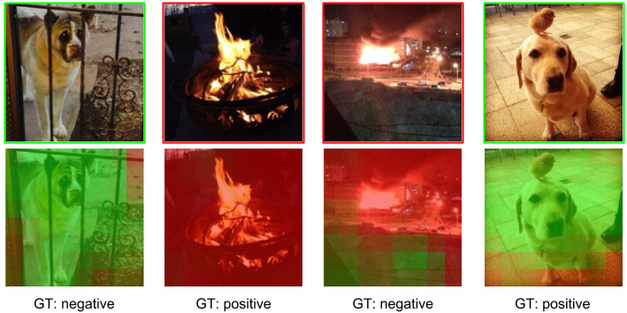

# From Pixels to Sentiment: Fine-tuning CNNs for Visual Sentiment Prediction

| ![Víctor Campos][VictorCampos-photo]  | ![Brendan Jou][BrendanJou-photo] |  ![Xavier Giro-i-Nieto][XavierGiro-photo]  | 
|:-:|:-:|:-:|:-:|:-:|
| Víctor Campos | [Brendan Jou](http://www.ee.columbia.edu/~bjou/) |  [Xavier Giro-i-Nieto](https://imatge.upc.edu/web/people/xavier-giro) |


[VictorCampos-photo]: ./figures/authors/VictorCampos.jpg "Víctor Campos"
[BrendanJou-photo]: ./figures/authors/BrendanJou.png "Brendan Jou"
[XavierGiro-photo]: ./figures/authors/XavierGiro.jpg "Xavier Giro-i-Nieto"


A joint collaboration between:

|  ![logo-upc] | ![logo-etsetb] | ![logo-gpi] | ![logo-columbia] | ![logo-dvmmlab] |
|:-:|:-:|:-:|:-:|:-:|
| [Universitat Politecnica de Catalunya (UPC)](http://www.upc.edu/?set_language=en)   | [UPC ETSETB TelecomBCN](https://www.etsetb.upc.edu/en/)  | [UPC Image Processing Group](https://imatge.upc.edu/web/) | [Columbia University](https://www.columbia.edu/ ) | [Digital Video and Multimedia Lab (DVMM)](www.ee.columbia.edu/dvmm)  |

[logo-upc]: ./figures/logos/upc.jpg "Universitat Politècnica de Catalunya"
[logo-etsetb]: ./figures/logos/etsetb.png "ETSETB TelecomBCN"
[logo-gpi]: ./figures/logos/gpi.png "UPC Image Processing Group"
[logo-columbia]: ./figures/logos/columbia.png "Columbia University"
[logo-dvmmlab]: ./figures/logos/dvmm.gif "Digital Video and Multimedia Lab"


## Abstract
Visual media have become a crucial part of our social lives. The throughput of generated multimedia content, together with its richness for conveying sentiments and feelings, highlights the need of automated visual sentiment analysis tools. We explore how Convolutional Neural Networks (CNNs), a computational learning paradigm that has shown outstanding performance in several vision tasks, can be applied to the task of visual sentiment prediction by fine-tuning a state-of-the-art CNN. We analyze its architecture, studying several performance boosting techniques, which led to a network tuned to achieve a 6.1% absolute accuracy improvement over the previous state-of-the-art on a dataset of images from a popular social media platform. Finally, we present visualizations of local patterns that the network associates to each image's sentiment.


## Publication

Please cite with the following Bibtex code:

````
@article{campos2016pixels2sentiments,
  title={From Pixels to Sentiment: Fine-tuning CNNs for Visual Sentiment Prediction},
  author={Campos, Victor and Jou, Brendan and Giro-i-Nieto, Xavier},
  journal={arXiv preprint arXiv:1604.03489},
  year={2016}
}
```

You may also want to refer to our publication with the more human-friendly APA style:

*(not published yet)*

A [preprint](http://arxiv.org/abs/1604.03489) of the paper is publicly available on arXiv.

## Sentiment Maps



## Models

The weights for the best CNN model can be downloaded from [here](https://imatge.upc.edu/web/sites/default/files/projects/affective/public_html/2017-imavis/twitter_finetuned_test4_iter_180.caffemodel) (217 MB). These same weights, modified to fit the fully convolutional architecture used to generate the sentiment maps, can be downloaded from [here](https://imatge.upc.edu/web/sites/default/files/projects/affective/public_html/2017-imavis/twitter_finetuned_test4_iter_180_conv.caffemodel) (217 MB).

The deep network was developed over [Caffe](http://caffe.berkeleyvision.org/) by [Berkeley Vision and Learning Center (BVLC)](http://bvlc.eecs.berkeley.edu/). You will need to follow [these instructions](http://caffe.berkeleyvision.org/installation.html) to install Caffe.


## Acknowledgments

We would like to especially thank Albert Gil Moreno and Josep Pujal from our technical support team at the Image Processing Group at  UPC.

| ![AlbertGil-photo]  | ![JosepPujal-photo]  |
|:-:|:-:|
| [Albert Gil](https://imatge.upc.edu/web/people/albert-gil-moreno)  |  [Josep Pujal](https://imatge.upc.edu/web/people/josep-pujal) |

[AlbertGil-photo]: ./figures/authors/AlbertGil.jpg "Albert Gil"
[JosepPujal-photo]: ./figures/authors/JosepPujal.jpg "Josep Pujal"

|   |   |
|:--|:-:|
|  We gratefully acknowledge the support of [NVIDIA Corporation](http://www.nvidia.com/content/global/global.php) with the donation of the GeForce GTX [Titan Z](http://www.nvidia.com/gtx-700-graphics-cards/gtx-titan-z/) and [Titan X](http://www.geforce.com/hardware/desktop-gpus/geforce-gtx-titan-x) used in this work. |  ![logo-nvidia] |
|  The Image Processing Group at the UPC is a [SGR14 Consolidated Research Group](https://imatge.upc.edu/web/projects/sgr14-image-and-video-processing-group) recognized and sponsored by the Catalan Government (Generalitat de Catalunya) through its [AGAUR](http://agaur.gencat.cat/en/inici/index.html) office. |  ![logo-catalonia] |
|  This work has been developed in the framework of the project [BigGraph TEC2013-43935-R](https://imatge.upc.edu/web/projects/biggraph-heterogeneous-information-and-graph-signal-processing-big-data-era-application), funded by the Spanish Ministerio de Economía y Competitividad and the European Regional Development Fund (ERDF).  | ![logo-spain] | 

[logo-nvidia]: ./figures/logos/nvidia.jpg "Logo of NVidia"
[logo-catalonia]: ./figures/logos/generalitat.jpg "Logo of Catalan government"
[logo-spain]: ./figures/logos/MEyC.png "Logo of Spanish government"


## Contact

If you have any general doubt about our work or code which may be of interest for other researchers, please use the [public issues section](https://github.com/imatge-upc/sentiment-2016-imavis/issues) on this github repo. Alternatively, drop us an e-mail at <mailto:xavier.giro@upc.edu>.
